# 人力资源管理系统 系统规格说明（草案）

> AISI 工具套件自动生成 ｜ profile：gjb438c ｜ 标准：GJB 2786A、GJB 438C、ISO/IEC/IEEE 29148、SysML v2
> 生成时间：2026-08-23T20:38:57 ｜ 四视图状态：全部 approved（门禁审计见 gates.json）

## 1 范围

黄金样例：基于Spring Boot的人事管理系统（用户提供的设计报告）

## 2 引用文件

- GJB 2786A
- GJB 438C
- ISO/IEC/IEEE 29148
- SysML v2

## 3 系统需求

### 3.0 需求树

```mermaid
flowchart TD
    rREQ001["REQ-001 功能需求"]
    rREQ001_1["REQ-001.1 员工资料管理"]
    rREQ001 --> rREQ001_1
    rREQ001_1_1["REQ-001.1.1 基本资料管理"]
    rREQ001_1 --> rREQ001_1_1
    rREQ001_1_1_1["REQ-001.1.1.1 档案增删改查"]
    rREQ001_1_1 --> rREQ001_1_1_1
    rREQ001_1_1_2["REQ-001.1.1.2 工号自动生成"]
    rREQ001_1_1 --> rREQ001_1_1_2
    rREQ001_1_1_3["REQ-001.1.1.3 必填项校验"]
    rREQ001_1_1 --> rREQ001_1_1_3
    rREQ001_1_1_4["REQ-001.1.1.4 多条件搜索"]
    rREQ001_1_1 --> rREQ001_1_1_4
    rREQ001_1_2["REQ-001.1.2 高级资料查询"]
    rREQ001_1 --> rREQ001_1_2
    rREQ001_1_2_1["REQ-001.1.2.1 培训资料查询"]
    rREQ001_1_2 --> rREQ001_1_2_1
    rREQ001_1_2_2["REQ-001.1.2.2 考评资料查询"]
    rREQ001_1_2 --> rREQ001_1_2_2
    rREQ001_1_2_3["REQ-001.1.2.3 工资信息查询"]
    rREQ001_1_2 --> rREQ001_1_2_3
    rREQ001_2["REQ-001.2 员工奖惩管理"]
    rREQ001 --> rREQ001_2
    rREQ001_2_1["REQ-001.2.1 添加奖惩"]
    rREQ001_2 --> rREQ001_2_1
    rREQ001_2_2["REQ-001.2.2 奖惩管理列表"]
    rREQ001_2 --> rREQ001_2_2
    rREQ001_3["REQ-001.3 员工培训与考评"]
    rREQ001 --> rREQ001_3
    rREQ001_3_1["REQ-001.3.1 培训管理"]
    rREQ001_3 --> rREQ001_3_1
    rREQ001_3_1_1["REQ-001.3.1.1 批量添加培训"]
    rREQ001_3_1 --> rREQ001_3_1_1
    rREQ001_3_1_2["REQ-001.3.1.2 在训唯一约束"]
    rREQ001_3_1 --> rREQ001_3_1_2
    rREQ001_3_1_3["REQ-001.3.1.3 培训进度管理"]
    rREQ001_3_1 --> rREQ001_3_1_3
    rREQ001_3_2["REQ-001.3.2 考评管理"]
    rREQ001_3 --> rREQ001_3_2
    rREQ001_3_2_1["REQ-001.3.2.1 批量添加考评"]
    rREQ001_3_2 --> rREQ001_3_2_1
    rREQ001_4["REQ-001.4 员工调动管理"]
    rREQ001 --> rREQ001_4
    rREQ001_5["REQ-001.5 薪资管理"]
    rREQ001 --> rREQ001_5
    rREQ001_5_1["REQ-001.5.1 工资账套管理"]
    rREQ001_5 --> rREQ001_5_1
    rREQ001_5_2["REQ-001.5.2 员工账套设置"]
    rREQ001_5 --> rREQ001_5_2
    rREQ001_5_3["REQ-001.5.3 工资表管理"]
    rREQ001_5 --> rREQ001_5_3
    rREQ001_6["REQ-001.6 统计分析"]
    rREQ001 --> rREQ001_6
    rREQ001_6_1["REQ-001.6.1 员工积分统计"]
    rREQ001_6 --> rREQ001_6_1
    rREQ001_6_2["REQ-001.6.2 人事信息分析"]
    rREQ001_6 --> rREQ001_6_2
    rREQ001_6_3["REQ-001.6.3 人事记录分析"]
    rREQ001_6 --> rREQ001_6_3
    rREQ001_7["REQ-001.7 人事通讯"]
    rREQ001 --> rREQ001_7
    rREQ001_8["REQ-001.8 基础信息设置"]
    rREQ001 --> rREQ001_8
    rREQ001_8_1["REQ-001.8.1 部门管理"]
    rREQ001_8 --> rREQ001_8_1
    rREQ001_8_2["REQ-001.8.2 职位管理"]
    rREQ001_8 --> rREQ001_8_2
    rREQ001_8_3["REQ-001.8.3 职称管理 ⚠"]
    rREQ001_8 --> rREQ001_8_3
    rREQ001_8_4["REQ-001.8.4 奖惩规则管理"]
    rREQ001_8 --> rREQ001_8_4
    rREQ001_8_5["REQ-001.8.5 权限组管理"]
    rREQ001_8 --> rREQ001_8_5
    rREQ001_9["REQ-001.9 系统管理"]
    rREQ001 --> rREQ001_9
    rREQ001_9_1["REQ-001.9.1 操作员管理"]
    rREQ001_9 --> rREQ001_9_1
    rREQ001_9_2["REQ-001.9.2 菜单权限配置"]
    rREQ001_9 --> rREQ001_9_2
    rREQ002["REQ-002 性能需求"]
    rREQ002_1["REQ-002.1 操作响应性能 ⚠"]
    rREQ002 --> rREQ002_1
    rREQ002_2["REQ-002.2 低配运行能力"]
    rREQ002 --> rREQ002_2
    rREQ003["REQ-003 数据需求"]
    rREQ003_1["REQ-003.1 员工主数据"]
    rREQ003 --> rREQ003_1
    rREQ003_2["REQ-003.2 权限数据模型"]
    rREQ003 --> rREQ003_2
    rREQ003_3["REQ-003.3 培训与考评数据"]
    rREQ003 --> rREQ003_3
    rREQ003_4["REQ-003.4 薪资数据"]
    rREQ003 --> rREQ003_4
    rREQ003_5["REQ-003.5 奖惩与积分数据"]
    rREQ003 --> rREQ003_5
    rREQ003_6["REQ-003.6 统计维度数据"]
    rREQ003 --> rREQ003_6
    rREQ003_7["REQ-003.7 基础信息数据"]
    rREQ003 --> rREQ003_7
    rREQ003_8["REQ-003.8 数据交换格式"]
    rREQ003 --> rREQ003_8
    rREQ004["REQ-004 部署需求"]
    rREQ004_1["REQ-004.1 部署形态"]
    rREQ004 --> rREQ004_1
    rREQ004_2["REQ-004.2 服务器运行环境"]
    rREQ004 --> rREQ004_2
    rREQ004_3["REQ-004.3 安装包大小"]
    rREQ004 --> rREQ004_3
    rREQ004_4["REQ-004.4 客户端浏览器环境"]
    rREQ004 --> rREQ004_4
    rREQ004_5["REQ-004.5 数据库环境"]
    rREQ004 --> rREQ004_5
    rREQ005["REQ-005 安全需求"]
    rREQ005_1["REQ-005.1 身份验证"]
    rREQ005 --> rREQ005_1
    rREQ005_2["REQ-005.2 RBAC鉴权"]
    rREQ005 --> rREQ005_2
    rREQ005_3["REQ-005.3 操作审计日志"]
    rREQ005 --> rREQ005_3
    rREQ005_4["REQ-005.4 保密级别授权"]
    rREQ005 --> rREQ005_4
    rREQ006["REQ-006 接口需求"]
    rREQ006_1["REQ-006.1 前后端数据接口"]
    rREQ006 --> rREQ006_1
    rREQ006_2["REQ-006.2 在线讯息接口"]
    rREQ006 --> rREQ006_2
    rREQ006_3["REQ-006.3 数据导入导出接口"]
    rREQ006 --> rREQ006_3
```

### 3.1 功能需求（40 条）

| ID | 名称 | 需求内容 | 优先级 | 验证 | 来源 |
|---|---|---|---|---|---|
| REQ-001 | 功能需求 | 系统应提供员工资料、奖惩、培训考评、调动、薪资、统计分析、在线通讯、基础信息设置与系统管理等功能。 | 必须 | 测试 | SRC-001#二 |
| REQ-001.1 | 员工资料管理 | 系统应支持员工资料管理，包括基本资料的增删改查与高级资料（培训、考评、工资）的查询。 | 必须 | 测试 | SRC-001#项目介绍、SRC-001#4.3 |
| REQ-001.1.1 | 基本资料管理 | 系统应支持员工基本资料的增删改查与批量导入导出。 | 必须 | 测试 | SRC-001#4.3.1 |
| REQ-001.1.1.1 | 档案增删改查 | 系统应实现对员工基本资料的增删改查；修改操作根据 id 进行数据更新。 | 必须 | 测试 | SRC-001#4.3.1 |
| REQ-001.1.1.2 | 工号自动生成 | 添加员工时工号应由数据库自动生成，无需人工录入。 | 必须 | 测试 | SRC-001#4.3.1 |
| REQ-001.1.1.3 | 必填项校验 | 工号以外的员工基本资料信息应为必填项。 | 必须 | 测试 | SRC-001#4.3.1 |
| REQ-001.1.1.4 | 多条件搜索 | 系统应支持按多个条件组合搜索员工基本资料。 | 必须 | 测试 | SRC-001#4.3.1 |
| REQ-001.1.2 | 高级资料查询 | 系统应支持员工高级资料的查询，高级资料由培训资料、考评资料、工资信息三部分构成。 | 必须 | 测试 | SRC-001#4.3.2 |
| REQ-001.1.2.1 | 培训资料查询 | 系统应支持查询员工培训资料，内容包含培训日期、培训内容。 | 必须 | 测试 | SRC-001#4.3.2 |
| REQ-001.1.2.2 | 考评资料查询 | 系统应支持查询员工考评资料，内容包含考评日期、考评内容、考评结果。 | 必须 | 测试 | SRC-001#4.3.2 |
| REQ-001.1.2.3 | 工资信息查询 | 系统应支持查询员工工资信息，内容包含账套名称、基本工资。 | 必须 | 测试 | SRC-001#4.3.2 |
| REQ-001.2 | 员工奖惩管理 | 系统应支持员工奖惩信息管理，员工实体与奖惩信息为一对多关系。 | 必须 | 测试 | SRC-001#4 |
| REQ-001.2.1 | 添加奖惩 | 系统应支持为员工添加奖惩记录，同一员工可添加多条。 | 必须 | 测试 | SRC-001#4.1 |
| REQ-001.2.2 | 奖惩管理列表 | 奖惩管理页面应显示有奖惩信息的全部员工，并支持查看奖惩详情。 | 必须 | 演示 | SRC-001#4.2 |
| REQ-001.3 | 员工培训与考评 | 系统应支持员工培训业务与员工评价业务的增删改查。 | 必须 | 测试 | SRC-001#5 |
| REQ-001.3.1 | 培训管理 | 系统应支持添加培训、培训管理、培训进度维护。 | 必须 | 测试 | SRC-001#5.1、SRC-001#5.2 |
| REQ-001.3.1.1 | 批量添加培训 | 系统应支持批量添加员工培训。 | 必须 | 演示 | SRC-001#5.2 |
| REQ-001.3.1.2 | 在训唯一约束 | 同一员工在一个时间段只能参加一个培训；培训完成删除当前培训后方可添加新培训。 | 必须 | 测试 | SRC-001#5.2 |
| REQ-001.3.1.3 | 培训进度管理 | 系统应支持培训进度的修改与进度条展示。 | 必须 | 演示 | SRC-001#5.2 |
| REQ-001.3.2 | 考评管理 | 系统应支持员工评价业务的增删改查，员工与考评为一对一关系。 | 必须 | 测试 | SRC-001#5.3、SRC-001#5.4 |
| REQ-001.3.2.1 | 批量添加考评 | 系统应支持批量添加员工评价，界面采用评分条与步骤条。 | 必须 | 演示 | SRC-001#5.4 |
| REQ-001.4 | 员工调动管理 | 系统应支持员工调动信息的增删改查，员工与调动信息为一对多关系。 | 必须 | 测试 | SRC-001#6 |
| REQ-001.5 | 薪资管理 | 系统应支持员工工资账套管理、员工账套设置、工资表管理一系列工资管理功能。 | 必须 | 测试 | SRC-001#7 |
| REQ-001.5.1 | 工资账套管理 | 系统应支持对员工奖金、基本工资、提成等各项的增删改查，并设置当前套账信息。 | 必须 | 测试 | SRC-001#7 |
| REQ-001.5.2 | 员工账套设置 | 系统应支持为员工设置工资账套。 | 必须 | 测试 | SRC-001#8 |
| REQ-001.5.3 | 工资表管理 | 系统应支持员工工资的搜索查看，可根据不同职称、部门进行表内筛选，并查看工资套账详情。 | 必须 | 演示 | SRC-001#9 |
| REQ-001.6 | 统计分析 | 系统应支持员工积分统计、人事信息分析与人事记录分析。 | 必须 | 演示 | SRC-001#10、SRC-001#11、SRC-001#12 |
| REQ-001.6.1 | 员工积分统计 | 系统应支持根据工号查找员工积分情况，以条形图显示有积分员工的积分分布；积分分值由员工奖惩产生。 | 必须 | 演示 | SRC-001#10 |
| REQ-001.6.2 | 人事信息分析 | 系统应以饼图方式展示员工人数分布，支持按高校、职称、职位、党派、民族、学历、部门维度统计。 | 必须 | 演示 | SRC-001#11 |
| REQ-001.6.3 | 人事记录分析 | 系统应支持员工离职信息统计，按部门、职称、职位维度对离职率、离职工龄、离职年龄进行分析，以柱状图结合折线图展示。 | 必须 | 演示 | SRC-001#12 |
| REQ-001.7 | 人事通讯 | 系统应实现操作员之间点对点在线讯息的及时通讯。 | 应当 | 演示 | SRC-001#项目介绍 |
| REQ-001.8 | 基础信息设置 | 系统应支持基础信息设置，包括部门、职位、职称、奖惩规则和权限组的管理。 | 必须 | 测试 | SRC-001#12基础信息设置 |
| REQ-001.8.1 | 部门管理 | 系统应支持部门的增删查改，并以部门树形式展示组织结构。 | 必须 | 测试 | SRC-001#12.1 |
| REQ-001.8.2 | 职位管理 | 系统应支持职位的增删查改。 | 必须 | 测试 | SRC-001#12.2 |
| REQ-001.8.3 | 职称管理 | 系统应支持职称信息的管理。 | 必须 | 测试 | SRC-001#12基础信息设置 |
| REQ-001.8.4 | 奖惩规则管理 | 系统应支持奖惩规则的设置与管理。 | 必须 | 测试 | SRC-001#12基础信息设置 |
| REQ-001.8.5 | 权限组管理 | 系统应支持权限组的设置与管理，并以权限树形式展示。 | 必须 | 测试 | SRC-001#12基础信息设置 |
| REQ-001.9 | 系统管理 | 系统应支持系统管理、管理员操作，包括基础设置、系统管理、操作员管理、授权处理。 | 必须 | 测试 | SRC-001#12系统管理 |
| REQ-001.9.1 | 操作员管理 | 系统应支持操作员管理，为不同用户授予不同角色。 | 必须 | 测试 | SRC-001#12系统管理、SRC-001#二 |
| REQ-001.9.2 | 菜单权限配置 | 系统管理应可根据不同角色分配菜单权限设置；为良好用户体验，前端默认不加载无权限菜单。 | 必须 | 演示 | SRC-001#2.1 |

### 3.2 性能需求（3 条）

| ID | 名称 | 需求内容 | 优先级 | 验证 | 来源 |
|---|---|---|---|---|---|
| REQ-002 | 性能需求 | 系统应满足操作响应与低资源配置下的运行性能要求。 | 应当 | 测试 | SRC-001#1.1 |
| REQ-002.1 | 操作响应性能 | 系统应由前端视图操作通知、结合后端逻辑处理消息构成用户体验处理，响应用户的每一步操作。 | 应当 | 演示 | SRC-001#1.1 |
| REQ-002.2 | 低配运行能力 | 系统应在普通单核 CPU、2G RAM 的 ECS 环境下满足运行性能需求。 | 应当 | 测试 | SRC-001#1.1 |

### 3.3 数据需求（9 条）

| ID | 名称 | 需求内容 | 优先级 | 验证 | 来源 |
|---|---|---|---|---|---|
| REQ-003 | 数据需求 | 系统应管理员工主数据、权限模型数据、培训考评数据、薪资数据、奖惩积分数据、统计维度数据与基础信息数据，并支持 Excel 数据交换。 | 必须 | 审查 | SRC-001#二、SRC-001#4.3.2 |
| REQ-003.1 | 员工主数据 | 系统应维护员工基本资料主数据：工号自动生成、其余字段必填；员工与奖惩信息一对多、与调动信息一对多、与在训培训一对一、与考评一对一。 | 必须 | 审查 | SRC-001#4.3.1、SRC-001#4、SRC-001#5、SRC-001#6 |
| REQ-003.2 | 权限数据模型 | 系统应维护 RBAC0 模型对应的五类数据实体：用户表、角色映射表、角色表、权限表、权限映射表。 | 必须 | 审查 | SRC-001#2.1 |
| REQ-003.3 | 培训与考评数据 | 系统应维护培训资料（培训日期、培训内容、培训进度）与考评资料（考评日期、考评内容、考评结果）数据。 | 必须 | 审查 | SRC-001#4.3.2、SRC-001#5 |
| REQ-003.4 | 薪资数据 | 系统应维护工资账套数据（奖金、基本工资、提成各项）、员工与账套的关联关系及工资表数据。 | 必须 | 审查 | SRC-001#7、SRC-001#8、SRC-001#9 |
| REQ-003.5 | 奖惩与积分数据 | 系统应维护员工奖惩记录数据；员工积分分值应由奖惩数据产生。 | 必须 | 审查 | SRC-001#10 |
| REQ-003.6 | 统计维度数据 | 系统应维护人事统计维度数据：高校、职称、职位、党派、民族、学历、部门，以及离职率、离职工龄、离职年龄。 | 必须 | 审查 | SRC-001#11、SRC-001#12 |
| REQ-003.7 | 基础信息数据 | 系统应维护部门树、职位、职称、奖惩规则、权限组等基础信息数据。 | 必须 | 审查 | SRC-001#12基础信息设置 |
| REQ-003.8 | 数据交换格式 | 系统应支持员工基本资料表的 Excel 导入导出数据格式。 | 必须 | 测试 | SRC-001#4.3.1 |

### 3.4 部署需求（6 条）

| ID | 名称 | 需求内容 | 优先级 | 验证 | 来源 |
|---|---|---|---|---|---|
| REQ-004 | 部署需求 | 系统应满足 B/S 架构、前后端分离的低成本部署要求。 | 应当 | 测试 | SRC-001#1.1、SRC-001#二 |
| REQ-004.1 | 部署形态 | 系统应采用 B/S 架构与前后端分离部署：前端作为独立 Server，后端使用 Spring Boot 内嵌 Tomcat 服务器，页面跳转由前端路由处理，前后端仅进行数据交互。 | 应当 | 审查 | SRC-001#二、SRC-001#4技术栈 |
| REQ-004.2 | 服务器运行环境 | 系统应可部署于普通单核 CPU、2G RAM 的 ECS 服务器。 | 应当 | 测试 | SRC-001#1.1 |
| REQ-004.3 | 安装包大小 | 系统打包后整体大小应约为 38MB，硬件内存需求相当于普通移动端 App 大小。 | 应当 | 测试 | SRC-001#1.1 |
| REQ-004.4 | 客户端浏览器环境 | 系统应兼容大部分浏览器访问，包括 IE 8/9/10/11、Chrome、Firefox。 | 应当 | 测试 | SRC-001#1.1 |
| REQ-004.5 | 数据库环境 | 系统应使用 MySQL 8.0 数据库存储数据。 | 必须 | 审查 | SRC-001#4技术栈 |

### 3.5 安全需求（5 条）

| ID | 名称 | 需求内容 | 优先级 | 验证 | 来源 |
|---|---|---|---|---|---|
| REQ-005 | 安全需求 | 系统应实现基于 RBAC 的访问控制、身份验证与操作留痕，保障人事信息保密。 | 必须 | 测试 | SRC-001#1 |
| REQ-005.1 | 身份验证 | 管理员或操作员须经自定义验证与表单验证通过后方可进入系统。 | 必须 | 测试 | SRC-001#2 |
| REQ-005.2 | RBAC鉴权 | 用户登录后应获取其所有角色并加载对应权限菜单；对直接输入 URL 的每一个请求，都应通过鉴权处理并判断是否可访问菜单资源。 | 必须 | 测试 | SRC-001#2.1 |
| REQ-005.3 | 操作审计日志 | 管理员对系统的操作应全部记录在日志里。 | 必须 | 审查 | SRC-001#2 |
| REQ-005.4 | 保密级别授权 | 对不同操作员角色应根据保密级别给予不同权限。 | 必须 | 审查 | SRC-001#1 |

### 3.6 接口需求（4 条）

| ID | 名称 | 需求内容 | 优先级 | 验证 | 来源 |
|---|---|---|---|---|---|
| REQ-006 | 接口需求 | 系统应提供前后端数据接口、在线讯息接口与数据导入导出接口。 | 必须 | 测试 | SRC-001#二、SRC-001#1.2 |
| REQ-006.1 | 前后端数据接口 | 前后端应通过接口使用 HTTP 协议交互，仅进行数据的交互，页面跳转不再由后端处理。 | 必须 | 测试 | SRC-001#二 |
| REQ-006.2 | 在线讯息接口 | 系统应基于 WebSocket 提供操作员之间点对点在线讯息通信接口。 | 应当 | 演示 | SRC-001#1.2 |
| REQ-006.3 | 数据导入导出接口 | 系统应提供员工基本资料 Excel 导入与导出接口。 | 必须 | 演示 | SRC-001#4.3.1 |

## 4 系统组成

### 4.0 模块分解树

```mermaid
flowchart TD
    mMOD00["📦 MOD-00 人力资源管理系统"]
    mMOD01["📦 MOD-01 员工资料管理子系统"]
    mMOD00 --> mMOD01
    mMOD11["🧩 MOD-11 基本资料管理模块"]
    mMOD01 --> mMOD11
    mMOD12["🧩 MOD-12 高级资料查询模块"]
    mMOD01 --> mMOD12
    mMOD02["📦 MOD-02 员工奖惩管理子系统"]
    mMOD00 --> mMOD02
    mMOD21["🧩 MOD-21 添加奖惩模块"]
    mMOD02 --> mMOD21
    mMOD22["🧩 MOD-22 奖惩管理列表模块"]
    mMOD02 --> mMOD22
    mMOD03["📦 MOD-03 员工培训与考评子系统"]
    mMOD00 --> mMOD03
    mMOD31["🧩 MOD-31 培训管理模块"]
    mMOD03 --> mMOD31
    mMOD32["🧩 MOD-32 考评管理模块"]
    mMOD03 --> mMOD32
    mMOD04["🧩 MOD-04 员工调动管理模块"]
    mMOD00 --> mMOD04
    mMOD05["📦 MOD-05 薪资管理子系统"]
    mMOD00 --> mMOD05
    mMOD51["🧩 MOD-51 工资账套管理模块"]
    mMOD05 --> mMOD51
    mMOD52["🧩 MOD-52 员工账套设置模块"]
    mMOD05 --> mMOD52
    mMOD53["🧩 MOD-53 工资表管理模块"]
    mMOD05 --> mMOD53
    mMOD06["📦 MOD-06 统计分析子系统"]
    mMOD00 --> mMOD06
    mMOD61["🧩 MOD-61 员工积分统计模块"]
    mMOD06 --> mMOD61
    mMOD62["🧩 MOD-62 人事信息分析模块"]
    mMOD06 --> mMOD62
    mMOD63["🧩 MOD-63 人事记录分析模块"]
    mMOD06 --> mMOD63
    mMOD07["🧩 MOD-07 人事通讯模块"]
    mMOD00 --> mMOD07
    mMOD08["📦 MOD-08 基础信息设置子系统"]
    mMOD00 --> mMOD08
    mMOD81["🧩 MOD-81 部门管理模块"]
    mMOD08 --> mMOD81
    mMOD82["🧩 MOD-82 职位管理模块"]
    mMOD08 --> mMOD82
    mMOD83["🧩 MOD-83 职称管理模块"]
    mMOD08 --> mMOD83
    mMOD84["🧩 MOD-84 奖惩规则管理模块"]
    mMOD08 --> mMOD84
    mMOD85["🧩 MOD-85 权限组管理模块"]
    mMOD08 --> mMOD85
    mMOD09["📦 MOD-09 系统管理子系统"]
    mMOD00 --> mMOD09
    mMOD91["🧩 MOD-91 操作员管理模块"]
    mMOD09 --> mMOD91
    mMOD92["🧩 MOD-92 菜单权限配置模块"]
    mMOD09 --> mMOD92
    mMOD10["🔧 MOD-10 RBAC 安全服务"]
    mMOD00 --> mMOD10
    mMOD20["🗄️ MOD-20 数据持久层"]
    mMOD00 --> mMOD20
    mMOD40["🔧 MOD-40 前后端交互服务"]
    mMOD00 --> mMOD40
```

| ID | 名称 | 类型 | 父模块 | 承载数求数 | 职责 |
|---|---|---|---|---|---|
| MOD-00 | 人力资源管理系统 | subsystem | — | 10 | 系统级功能、性能与部署目标承载；端到端人事业务闭环 |
| MOD-01 | 员工资料管理子系统 | subsystem | MOD-00 | 1 | 员工基本资料与高级资料管理 |
| MOD-11 | 基本资料管理模块 | module | MOD-01 | 5 | 档案增删改查（按id更新）；工号自动生成；必填项校验 |
| MOD-12 | 高级资料查询模块 | module | MOD-01 | 4 | 培训资料查询；考评资料查询；工资信息查询 |
| MOD-02 | 员工奖惩管理子系统 | subsystem | MOD-00 | 1 | 奖惩记录全生命周期管理 |
| MOD-21 | 添加奖惩模块 | module | MOD-02 | 1 | 为员工添加奖惩记录，同一员工可多条 |
| MOD-22 | 奖惩管理列表模块 | module | MOD-02 | 1 | 展示有奖惩信息的全部员工；查看奖惩详情 |
| MOD-03 | 员工培训与考评子系统 | subsystem | MOD-00 | 1 | 培训业务与评价业务管理 |
| MOD-31 | 培训管理模块 | module | MOD-03 | 4 | 批量添加培训；在训唯一约束（同期仅1个）；培训进度维护（进度条） |
| MOD-32 | 考评管理模块 | module | MOD-03 | 2 | 批量添加评价（评分条/步骤条）；考评增删改查 |
| MOD-04 | 员工调动管理模块 | module | MOD-00 | 1 | 调动信息增删改查 |
| MOD-05 | 薪资管理子系统 | subsystem | MOD-00 | 1 | 工资账套、员工账套、工资表管理 |
| MOD-51 | 工资账套管理模块 | module | MOD-05 | 1 | 奖金/基本工资/提成各项增删改查；设置当前套账 |
| MOD-52 | 员工账套设置模块 | module | MOD-05 | 1 | 为员工设置工资账套 |
| MOD-53 | 工资表管理模块 | module | MOD-05 | 1 | 工资搜索查看；按职称/部门表内筛选；套账详情查看 |
| MOD-06 | 统计分析子系统 | subsystem | MOD-00 | 1 | 积分统计与人事分析 |
| MOD-61 | 员工积分统计模块 | module | MOD-06 | 1 | 按工号查积分；条形图展示积分分布 |
| MOD-62 | 人事信息分析模块 | module | MOD-06 | 1 | 饼图人员分布：高校/职称/职位/党派/民族/学历/部门 |
| MOD-63 | 人事记录分析模块 | module | MOD-06 | 1 | 离职率/离职工龄/离职年龄分析（柱状+折线） |
| MOD-07 | 人事通讯模块 | module | MOD-00 | 1 | 操作员间点对点在线讯息 |
| MOD-08 | 基础信息设置子系统 | subsystem | MOD-00 | 1 | 部门/职位/职称/奖惩规则/权限组管理 |
| MOD-81 | 部门管理模块 | module | MOD-08 | 1 | 部门增删查改；部门树展示 |
| MOD-82 | 职位管理模块 | module | MOD-08 | 1 | 职位增删查改 |
| MOD-83 | 职称管理模块 | module | MOD-08 | 1 | 职称信息管理（细节待澄清） |
| MOD-84 | 奖惩规则管理模块 | module | MOD-08 | 1 | 奖惩规则设置与管理 |
| MOD-85 | 权限组管理模块 | module | MOD-08 | 1 | 权限组设置；权限树展示 |
| MOD-09 | 系统管理子系统 | subsystem | MOD-00 | 1 | 操作员管理与授权处理 |
| MOD-91 | 操作员管理模块 | module | MOD-09 | 1 | 操作员管理；为用户授予角色 |
| MOD-92 | 菜单权限配置模块 | module | MOD-09 | 1 | 按角色分配菜单权限；前端默认不加载无权限菜单 |
| MOD-10 | RBAC 安全服务 | service | MOD-00 | 5 | 身份验证（自定义+表单验证）；RBAC 鉴权（URL 直达拦截）；操作审计日志 |
| MOD-20 | 数据持久层 | database | MOD-00 | 9 | 员工主数据（1:N/1:1 关系）；RBAC 五表数据；培训考评数据 |
| MOD-40 | 前后端交互服务 | service | MOD-00 | 4 | HTTP 前后端数据接口；WebSocket 在线讯息接口；Excel 导入导出接口 |

## 5 系统架构

### 5.0 分层架构

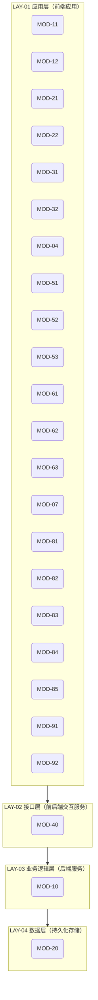

| 层 | 名称 | 技术栈 | 模块数 | 说明 |
|---|---|---|---|---|
| LAY-01 | 应用层（前端应用） | Vue.js、ElementUI、vue-router、axios、JavaScript | 21 | MVVM 模式 Vue.js 单页应用（SPA），前后端分离，页面跳转由 vue-router 前端路由处理 |
| LAY-02 | 接口层（前后端交互服务） | HTTP/REST、WebSocket、文件流（Excel） | 1 | 前后端仅进行数据交互：HTTP 协议接口、WebSocket 在线讯息、Excel 数据导入导出 |
| LAY-03 | 业务逻辑层（后端服务） | Java 8、Spring Boot（IOC/MVC/ORM）、Spring Security、MyBatis | 1 | Spring Boot 内嵌 Tomcat 承载后端业务逻辑与安全框架；基于 Servlet Filter 原理实现鉴权 |
| LAY-04 | 数据层（持久化存储） | MySQL 8.0、RBAC0 五表模型 | 1 | MySQL 关系数据库存储；工号由数据库自动生成；RBAC 五表模型 |

### 5.1 服务清单

| ID | 服务 | 类型 | 挂载模块 | API |
|---|---|---|---|---|
| SVC-01 | RBAC 权限服务 | business | MOD-10 | Spring Security 过滤器链（鉴权基于 Servlet Filter 原理，授权由系统管理员操作） |
| SVC-02 | WebSocket 在线讯息服务 | business | MOD-40 | WebSocket 双向通信 |
| SVC-03 | Excel 导入导出服务 | data | MOD-40 | 文件流导入导出接口 |
| SVC-04 | 统计分析数据服务 | data | MOD-06 | 后端统计聚合查询 |
| SVC-05 | MySQL 数据库服务 | data | MOD-20 | MySQL 8.0 |

### 5.2 数据资产

| ID | 数据资产 | 实体 | 存储 | 归属 | 敏感级 |
|---|---|---|---|---|---|
| DA-01 | 员工主数据 | Employee（员工）、RewardPenalty（奖惩）、Transfer（调动）、Training（培训） | MySQL 8.0 | MOD-20 | 机密 |
| DA-02 | RBAC 权限数据 | User（用户表）、RoleMapping（角色映射表）、Role（角色表）、Permission（权限表） | MySQL 8.0 | MOD-10 | 机密 |
| DA-03 | 薪资数据 | SalaryAccount（工资账套：奖金/基本工资/提成）、EmployeeAccount（员工账套设置）、Payroll（工资表） | MySQL 8.0 | MOD-05 | 机密 |
| DA-04 | 统计维度数据 | 高校/职称/职位/党派/民族/学历/部门维度、离职记录（离职率/工龄/年龄） | MySQL 8.0 | MOD-06 | 内部 |
| DA-05 | 基础信息数据 | Department（部门树）、Position（职位）、Title（职称）、RewardRule（奖惩规则） | MySQL 8.0 | MOD-08 | 内部 |

### 5.3 部署节点

| ID | 节点 | 规格 | 承载 | 协议 |
|---|---|---|---|---|
| N-01 | 应用服务器（ECS） | 普通单核 CPU、2G RAM（原文表述 ESC，按 ECS 理解） | SVC-01、SVC-02、SVC-03、SVC-04 | HTTP/HTTPS |
| N-02 | 数据库服务器 | MySQL 8.0 | SVC-05 | SQL/TCP |
| N-03 | 客户端浏览器 | IE 8/9/10/11、Chrome、Firefox | 客户端 | HTTP/HTTPS |

## 6 业务流程

### 6.001 用户登录与访问控制流程（PRC-001）

触发：管理员或操作员访问系统 ｜ 参与者：用户、系统

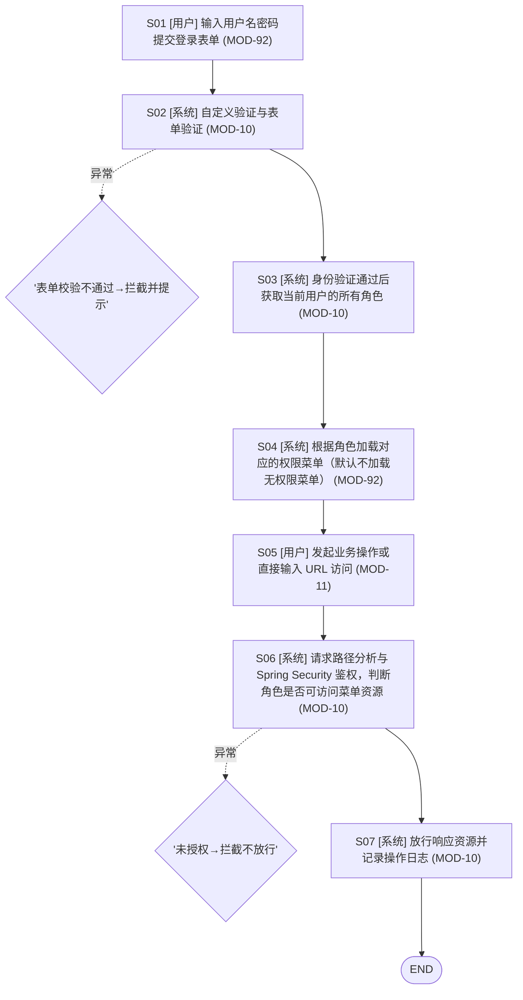

| 步骤 | 执行者 | 动作 | 模块 | 输入 | 输出 | 异常 |
|---|---|---|---|---|---|---|
| S01 | 用户 | 输入用户名密码提交登录表单 | MOD-92 | 用户凭证 | 登录请求 |  |
| S02 | 系统 | 自定义验证与表单验证 | MOD-10 | 登录请求 | 验证结果 | 表单校验不通过→拦截并提示 |
| S03 | 系统 | 身份验证通过后获取当前用户的所有角色 | MOD-10 | 验证结果 | 用户角色列表 |  |
| S04 | 系统 | 根据角色加载对应的权限菜单（默认不加载无权限菜单） | MOD-92 | 用户角色列表 | 权限菜单 |  |
| S05 | 用户 | 发起业务操作或直接输入 URL 访问 | MOD-11 | 权限菜单 | 业务请求 |  |
| S06 | 系统 | 请求路径分析与 Spring Security 鉴权，判断角色是否可访问菜单资源 | MOD-10 | 业务请求 | 鉴权结果 | 未授权→拦截不放行 |
| S07 | 系统 | 放行响应资源并记录操作日志 | MOD-10 | 鉴权结果 | 菜单资源、操作日志 |  |

### 6.002 员工入职建档流程（PRC-002）

触发：新员工入职 ｜ 参与者：HR

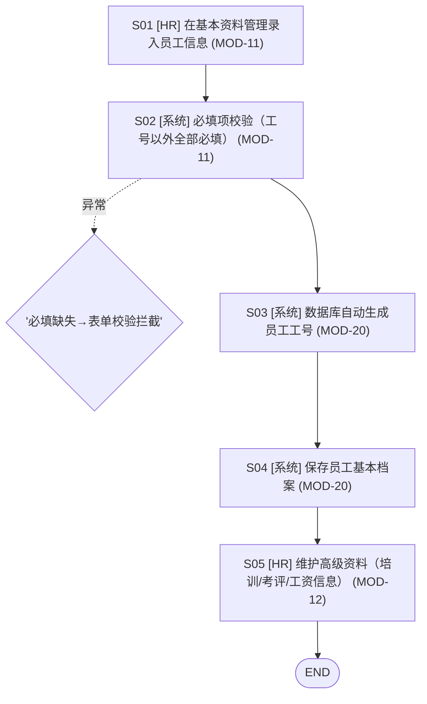

| 步骤 | 执行者 | 动作 | 模块 | 输入 | 输出 | 异常 |
|---|---|---|---|---|---|---|
| S01 | HR | 在基本资料管理录入员工信息 | MOD-11 | 员工纸质资料 | 录入表单 |  |
| S02 | 系统 | 必填项校验（工号以外全部必填） | MOD-11 | 录入表单 | 校验结果 | 必填缺失→表单校验拦截 |
| S03 | 系统 | 数据库自动生成员工工号 | MOD-20 | 校验结果 | 员工工号 |  |
| S04 | 系统 | 保存员工基本档案 | MOD-20 | 员工工号、录入表单 | 员工档案记录 |  |
| S05 | HR | 维护高级资料（培训/考评/工资信息） | MOD-12 | 员工档案记录 | 高级资料关联 |  |

### 6.003 员工奖惩办理流程（PRC-003）

触发：员工获得奖励或处分 ｜ 参与者：HR

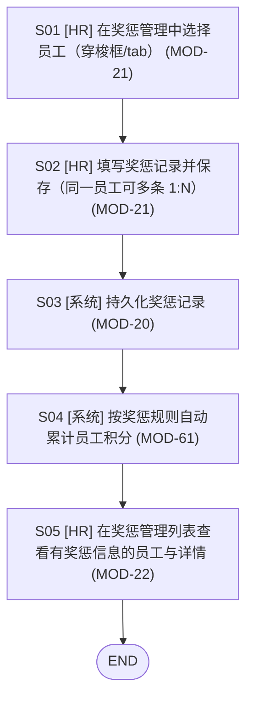

| 步骤 | 执行者 | 动作 | 模块 | 输入 | 输出 | 异常 |
|---|---|---|---|---|---|---|
| S01 | HR | 在奖惩管理中选择员工（穿梭框/tab） | MOD-21 | 员工列表 | 目标员工 |  |
| S02 | HR | 填写奖惩记录并保存（同一员工可多条 1:N） | MOD-21 | 目标员工、奖惩内容 | 奖惩记录 |  |
| S03 | 系统 | 持久化奖惩记录 | MOD-20 | 奖惩记录 | 奖惩数据 |  |
| S04 | 系统 | 按奖惩规则自动累计员工积分 | MOD-61 | 奖惩数据 | 员工积分 |  |
| S05 | HR | 在奖惩管理列表查看有奖惩信息的员工与详情 | MOD-22 | 奖惩数据 | 奖惩列表展示 |  |

### 6.004 员工培训办理流程（PRC-004）

触发：员工参加培训 ｜ 参与者：HR

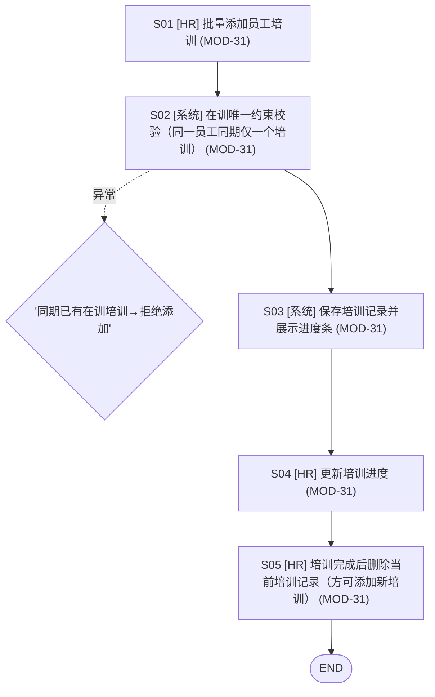

| 步骤 | 执行者 | 动作 | 模块 | 输入 | 输出 | 异常 |
|---|---|---|---|---|---|---|
| S01 | HR | 批量添加员工培训 | MOD-31 | 员工列表、培训计划 | 培训记录草稿 |  |
| S02 | 系统 | 在训唯一约束校验（同一员工同期仅一个培训） | MOD-31 | 培训记录草稿 | 校验结果 | 同期已有在训培训→拒绝添加 |
| S03 | 系统 | 保存培训记录并展示进度条 | MOD-31 | 校验结果 | 培训记录 |  |
| S04 | HR | 更新培训进度 | MOD-31 | 培训记录 | 进度更新 |  |
| S05 | HR | 培训完成后删除当前培训记录（方可添加新培训） | MOD-31 | 培训记录 | 培训完结 |  |

### 6.005 员工考评办理流程（PRC-005）

触发：考评周期到达 ｜ 参与者：HR

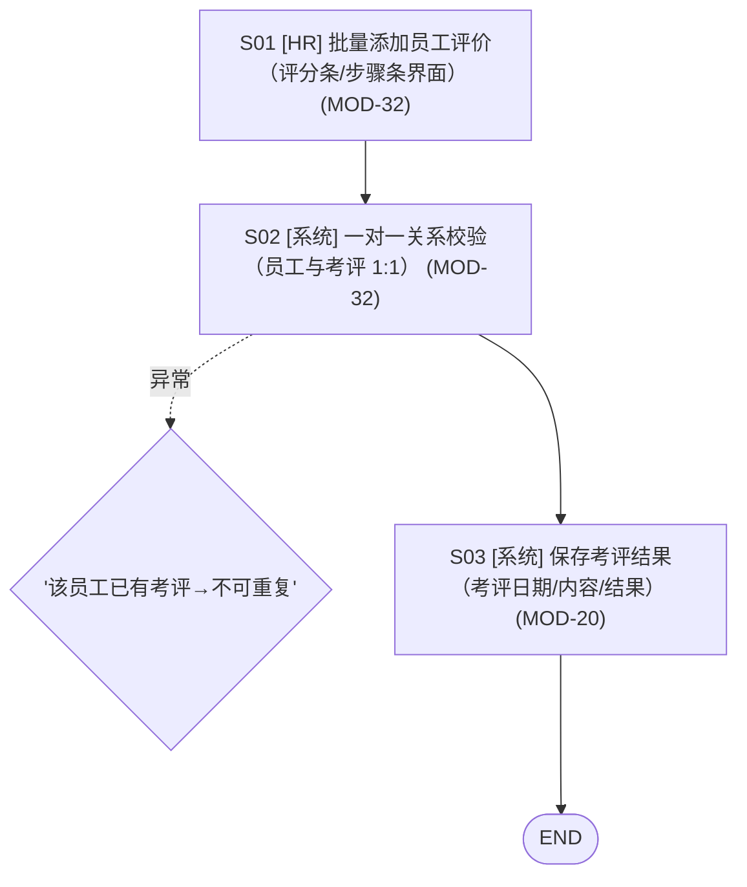

| 步骤 | 执行者 | 动作 | 模块 | 输入 | 输出 | 异常 |
|---|---|---|---|---|---|---|
| S01 | HR | 批量添加员工评价（评分条/步骤条界面） | MOD-32 | 员工列表、评价内容 | 评价草稿 |  |
| S02 | 系统 | 一对一关系校验（员工与考评 1:1） | MOD-32 | 评价草稿 | 校验结果 | 该员工已有考评→不可重复 |
| S03 | 系统 | 保存考评结果（考评日期/内容/结果） | MOD-20 | 校验结果 | 考评记录 |  |

### 6.006 员工调动办理流程（PRC-006）

触发：员工岗位/部门变动 ｜ 参与者：HR

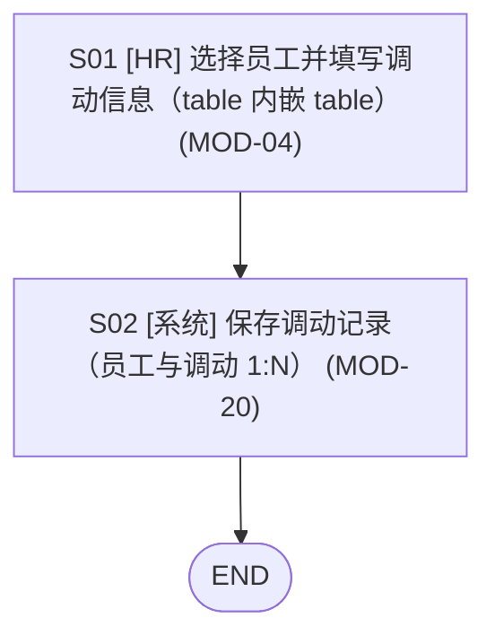

| 步骤 | 执行者 | 动作 | 模块 | 输入 | 输出 | 异常 |
|---|---|---|---|---|---|---|
| S01 | HR | 选择员工并填写调动信息（table 内嵌 table） | MOD-04 | 员工列表、调动内容 | 调动草稿 |  |
| S02 | 系统 | 保存调动记录（员工与调动 1:N） | MOD-20 | 调动草稿 | 调动记录 |  |

### 6.007 工资管理流程（PRC-007）

触发：薪资设定与发放周期 ｜ 参与者：HR、财务

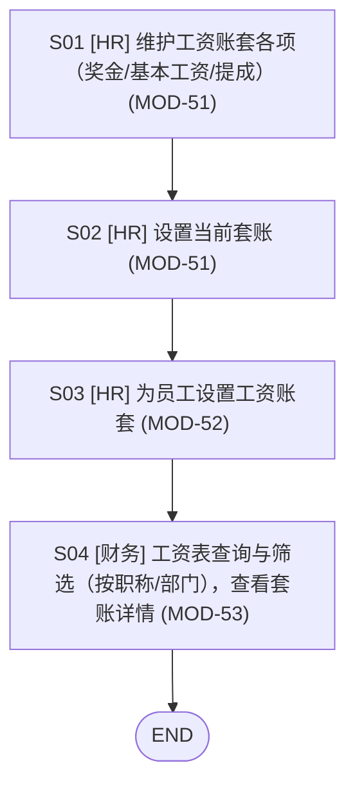

| 步骤 | 执行者 | 动作 | 模块 | 输入 | 输出 | 异常 |
|---|---|---|---|---|---|---|
| S01 | HR | 维护工资账套各项（奖金/基本工资/提成） | MOD-51 | 薪资政策 | 账套定义 |  |
| S02 | HR | 设置当前套账 | MOD-51 | 账套定义 | 当前套账 |  |
| S03 | HR | 为员工设置工资账套 | MOD-52 | 员工列表、当前套账 | 员工账套关联 |  |
| S04 | 财务 | 工资表查询与筛选（按职称/部门），查看套账详情 | MOD-53 | 员工账套关联 | 工资表 |  |

### 6.008 前端请求统一处理流程（PRC-008）

触发：任意前端操作触发请求 ｜ 参与者：系统

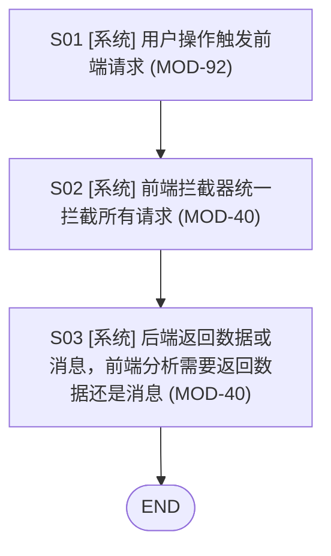

| 步骤 | 执行者 | 动作 | 模块 | 输入 | 输出 | 异常 |
|---|---|---|---|---|---|---|
| S01 | 系统 | 用户操作触发前端请求 | MOD-92 | 用户操作 | HTTP 请求 |  |
| S02 | 系统 | 前端拦截器统一拦截所有请求 | MOD-40 | HTTP 请求 | 拦截后请求 |  |
| S03 | 系统 | 后端返回数据或消息，前端分析需要返回数据还是消息 | MOD-40 | 拦截后请求 | 响应结果 |  |

## 7 接口与数据流

### 7.0 接口

| ID | 接口 | 提供方 | 消费方 | 风格/协议 | 消息 |
|---|---|---|---|---|---|
| IF-01 | 登录认证接口 | MOD-10 | MOD-92 | 自定义验证+表单验证/HTTP | 登录请求(request)；鉴权结果(response) |
| IF-02 | 在线讯息接口 | MOD-40 | MOD-07 | WebSocket 双向通信/WebSocket | 讯息报文(request) |
| IF-03 | Excel 导入导出接口 | MOD-40 | MOD-11 | 文件流/HTTP | 导入文件(request)；导出文件(response) |
| IF-04 | 业务数据接口 | MOD-40 | MOD-11、MOD-21、MOD-31、MOD-51、MOD-53、MOD-61、MOD-62 | REST 风格/HTTP | 业务请求(request)；数据或消息(response) |

### 7.1 数据流

| ID | 源 | 目标 | 载荷 | 频率 |
|---|---|---|---|---|
| DF-01 | MOD-21 | MOD-20 | 奖惩记录 | 实时 |
| DF-02 | MOD-20 | MOD-61 | 奖惩积分数据 | 奖惩事件触发 |
| DF-03 | MOD-51 | MOD-20 | 工资账套定义与当前套账 | 实时 |
| DF-04 | MOD-20 | MOD-53 | 工资表数据（按职称/部门筛选） | 按需查询 |
| DF-05 | MOD-20 | MOD-62 | 人事维度分布数据（7 维） | 按需查询 |
| DF-06 | MOD-11 | MOD-12 | 员工档案与高级资料关联 | 实时 |

## 8 需求追踪概览

- 追踪边 170 条
- 孤儿需求 0 ｜ 空模块 0 ｜ 未分层模块 8

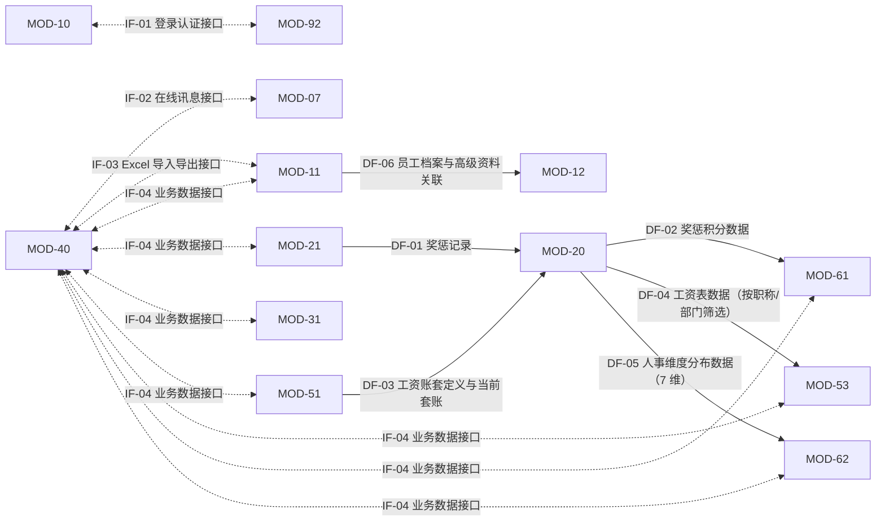

## 9 待澄清事项

- **REQ-001.8.3 职称管理**：报告未展开职称管理细节，是否与职位管理同构？（可 `aisi clarify REQ-001.8.3 --answer` 回填，或启用调研）
- **REQ-002.1 操作响应性能**：报告未给出量化响应指标（如页面响应时间上限），是否需要补充？（可 `aisi clarify REQ-002.1 --answer` 回填，或启用调研）
